# Detailed Database Schema

## Complete Field-Level Schema

```mermaid
erDiagram
    %% Core Analytics & Downloads
    analytics {
        TEXT id PK "UUID"
        TEXT visitor_id "Anonymous visitor ID"
        TEXT page_url "Page URL"
        TEXT user_agent "Browser user agent"
        TEXT ip_address "Visitor IP"
        TEXT referrer "Referrer URL"
        TEXT email "User email (if available)"
        TEXT action "Action type"
        TEXT timestamp "Event timestamp"
        INTEGER scroll_depth "Scroll depth %"
        INTEGER time_on_page "Time on page (seconds)"
        TEXT created_at "Record creation time"
    }

    downloads {
        TEXT id PK "UUID"
        TEXT visitor_id "Anonymous visitor ID"
        TEXT email "User email"
        TEXT token "Download token"
        TEXT ip_address "Download IP"
        TEXT user_agent "Browser user agent"
        TEXT created_at "Download timestamp"
    }

    download_tokens {
        TEXT id PK "UUID"
        TEXT email "User email"
        TEXT token UK "Unique download token"
        TEXT expires_at "Token expiration"
        INTEGER used "0=unused, 1=used"
        TEXT created_at "Token creation time"
    }

    anonymous_counters {
        INTEGER id PK "Auto-increment"
        TEXT key UK "Counter key"
        INTEGER total_visits "Total page visits"
        INTEGER total_downloads "Total downloads"
        INTEGER total_email_submissions "Total email submissions"
        INTEGER total_goodreads_clicks "Goodreads clicks"
        INTEGER total_substack_clicks "Substack clicks"
        INTEGER total_publisher_clicks "Publisher clicks"
        TEXT last_updated "Last update time"
        TEXT created_at "Record creation time"
    }

    %% A/B Testing
    ab_tests {
        TEXT id PK "UUID"
        TEXT name "Test name"
        TEXT description "Test description"
        TEXT type "Test type (cta_button_color, headline_text, etc.)"
        TEXT status "draft, running, completed, paused"
        INTEGER traffic_split "Traffic split percentage"
        TEXT start_date "Test start date"
        TEXT end_date "Test end date"
        TEXT target_element "Target element name"
        TEXT target_selector "CSS selector"
        TEXT conversion_goal "JSON conversion goal"
        REAL statistical_significance "Statistical significance %"
        INTEGER total_visitors "Total visitors"
        INTEGER conversions "Total conversions"
        REAL conversion_rate "Overall conversion rate %"
        TEXT created_at "Test creation time"
        TEXT updated_at "Last update time"
    }

    ab_variants {
        TEXT id PK "UUID"
        TEXT test_id FK "Reference to ab_tests"
        TEXT name "Variant name"
        TEXT description "Variant description"
        TEXT value "Variant value"
        TEXT css_class "CSS class"
        TEXT css_style "CSS styles"
        INTEGER visitors "Variant visitors"
        INTEGER conversions "Variant conversions"
        REAL conversion_rate "Variant conversion rate %"
        INTEGER is_control "0=variant, 1=control"
        INTEGER is_winner "0=not winner, 1=winner"
        REAL confidence_level "Statistical confidence %"
        REAL improvement "Improvement over control %"
        REAL traffic_split "Variant traffic split %"
        TEXT created_at "Variant creation time"
        TEXT updated_at "Last update time"
    }

    ab_test_results {
        TEXT id PK "UUID"
        TEXT test_id FK "Reference to ab_tests"
        TEXT variant_id FK "Reference to ab_variants"
        TEXT visitor_id "Visitor identifier"
        TEXT timestamp "Result timestamp"
        INTEGER conversion "0=no conversion, 1=conversion"
        REAL conversion_value "Conversion value"
        TEXT created_at "Result creation time"
    }

    ab_visitor_assignments {
        TEXT id PK "UUID"
        TEXT visitor_id "Visitor identifier"
        TEXT test_id FK "Reference to ab_tests"
        TEXT variant_id FK "Reference to ab_variants"
        TEXT assigned_at "Assignment timestamp"
    }

    %% Email Templates
    email_templates {
        INTEGER id PK "Auto-increment"
        TEXT name "Template name"
        TEXT subject "Email subject"
        TEXT html_content "HTML email content"
        TEXT text_content "Plain text content"
        TEXT description "Template description"
        INTEGER is_default "0=not default, 1=default"
        TEXT created_at "Template creation time"
        TEXT updated_at "Last update time"
    }

    template_placeholders {
        INTEGER id PK "Auto-increment"
        INTEGER template_id FK "Reference to email_templates"
        TEXT placeholder_key "Placeholder key (e.g., user_name)"
        TEXT placeholder_name "Human-readable name"
        TEXT description "Placeholder description"
        TEXT default_value "Default value"
        INTEGER is_required "0=optional, 1=required"
        TEXT created_at "Placeholder creation time"
    }

    template_categories {
        INTEGER id PK "Auto-increment"
        TEXT name UK "Category name"
        TEXT description "Category description"
        TEXT created_at "Category creation time"
    }

    template_categories_assignments {
        INTEGER template_id FK "Reference to email_templates"
        INTEGER category_id FK "Reference to template_categories"
    }

    %% Email Themes
    email_theme_categories {
        INTEGER id PK "Auto-increment"
        TEXT name UK "Category name"
        TEXT description "Category description"
        TEXT created_at "Category creation time"
    }

    email_themes {
        INTEGER id PK "Auto-increment"
        TEXT name "Theme name"
        TEXT description "Theme description"
        INTEGER category_id FK "Reference to email_theme_categories"
        INTEGER is_default "0=not default, 1=default"
        INTEGER is_custom "0=predefined, 1=custom"
        INTEGER created_by "User who created (future use)"
        TEXT created_at "Theme creation time"
        TEXT updated_at "Last update time"
    }

    email_theme_properties {
        INTEGER id PK "Auto-increment"
        INTEGER theme_id FK "Reference to email_themes"
        TEXT property_key "Property key (e.g., primary_color)"
        TEXT property_value "Property value"
        TEXT property_type "css, html, or json"
        TEXT created_at "Property creation time"
    }

    email_template_themes {
        INTEGER id PK "Auto-increment"
        INTEGER template_id FK "Reference to email_templates"
        INTEGER theme_id FK "Reference to email_themes"
        TEXT created_at "Assignment creation time"
    }

    %% Email Analytics
    email_template_usage {
        INTEGER id PK "Auto-increment"
        INTEGER template_id FK "Reference to email_templates"
        TEXT sent_at "Email sent timestamp"
        TEXT recipient_email "Recipient email"
        TEXT subject "Email subject"
        TEXT status "sent, delivered, opened, clicked, bounced, failed"
        TEXT opened_at "Email opened timestamp"
        TEXT clicked_at "Email clicked timestamp"
        TEXT bounce_reason "Bounce reason (if applicable)"
        TEXT user_agent "Recipient user agent"
        TEXT ip_address "Recipient IP"
        TEXT created_at "Usage record creation time"
    }

    email_template_metrics {
        INTEGER id PK "Auto-increment"
        INTEGER template_id FK "Reference to email_templates"
        TEXT date "Metrics date"
        INTEGER total_sent "Total emails sent"
        INTEGER total_delivered "Total emails delivered"
        INTEGER total_opened "Total emails opened"
        INTEGER total_clicked "Total emails clicked"
        INTEGER total_bounced "Total emails bounced"
        INTEGER total_failed "Total emails failed"
        REAL open_rate "Open rate %"
        REAL click_rate "Click rate %"
        REAL bounce_rate "Bounce rate %"
        TEXT created_at "Metrics creation time"
        TEXT updated_at "Last update time"
    }

    email_template_ab_tests {
        INTEGER id PK "Auto-increment"
        TEXT test_name "A/B test name"
        INTEGER template_a_id FK "Reference to email_templates (variant A)"
        INTEGER template_b_id FK "Reference to email_templates (variant B)"
        TEXT start_date "Test start date"
        TEXT end_date "Test end date"
        TEXT status "active, completed, paused"
        INTEGER winner_template_id FK "Reference to email_templates (winner)"
        REAL confidence_level "Statistical confidence %"
        INTEGER total_participants "Total participants"
        TEXT created_at "Test creation time"
    }

    %% Relationships with detailed descriptions
    ab_variants ||--o{ ab_tests : "belongs_to (many variants per test)"
    ab_test_results ||--o{ ab_tests : "belongs_to (many results per test)"
    ab_test_results ||--o{ ab_variants : "belongs_to (many results per variant)"
    ab_visitor_assignments ||--o{ ab_tests : "belongs_to (many assignments per test)"
    ab_visitor_assignments ||--o{ ab_variants : "assigned_to (one assignment per visitor per test)"

    template_placeholders ||--o{ email_templates : "belongs_to (many placeholders per template)"
    template_categories_assignments ||--o{ email_templates : "assigned_to (many-to-many relationship)"
    template_categories_assignments ||--o{ template_categories : "assigned_to (many-to-many relationship)"

    email_themes ||--o{ email_theme_categories : "belongs_to (many themes per category)"
    email_theme_properties ||--o{ email_themes : "belongs_to (many properties per theme)"
    email_template_themes ||--o{ email_templates : "assigned_to (one theme per template)"
    email_template_themes ||--o{ email_themes : "assigned_to (one theme per template)"

    email_template_usage ||--o{ email_templates : "belongs_to (many usage records per template)"
    email_template_metrics ||--o{ email_templates : "belongs_to (one metric record per template per date)"
    email_template_ab_tests ||--o{ email_templates : "template_a (variant A template)"
    email_template_ab_tests ||--o{ email_templates : "template_b (variant B template)"
    email_template_ab_tests ||--o{ email_templates : "winner (winning template)"
```

## Field Type Mapping

### PostgreSQL (Supabase) → SQLite
| PostgreSQL Type | SQLite Type | Example | Notes |
|----------------|-------------|---------|-------|
| `UUID` | `TEXT` | `"550e8400-e29b-41d4-a716-446655440000"` | Custom UUID generation |
| `SERIAL` | `INTEGER AUTOINCREMENT` | `1, 2, 3...` | Auto-incrementing |
| `BOOLEAN` | `INTEGER` | `0, 1` | 0=false, 1=true |
| `TIMESTAMP WITH TIME ZONE` | `TEXT` | `"2024-01-15 10:30:00"` | `datetime('now')` |
| `JSONB` | `TEXT` | `'{"key": "value"}'` | JSON as text |
| `DECIMAL(5,2)` | `REAL` | `12.34` | Floating point |
| `VARCHAR(255)` | `TEXT` | `"string value"` | No length limit |

## Indexes Summary

### Performance Indexes
- **analytics**: `visitor_id`, `action`, `timestamp`
- **downloads**: `email`, `token`, `created_at`
- **download_tokens**: `email`, `token`, `expires_at`
- **ab_tests**: `status`, `created_at`
- **ab_variants**: `test_id`
- **ab_test_results**: `test_id`, `visitor_id`
- **ab_visitor_assignments**: `visitor_id`, `test_id`
- **email_templates**: `name`, `is_default`
- **template_placeholders**: `template_id`, `placeholder_key`
- **email_themes**: `category_id`, `is_default`
- **email_theme_properties**: `theme_id`
- **email_template_themes**: `template_id`, `theme_id`
- **email_template_usage**: `template_id`, `sent_at`, `status`
- **email_template_metrics**: `template_id`, `date`
- **email_template_ab_tests**: `status`

## Constraints Summary

### Primary Keys
- All tables have primary keys (UUID or auto-increment)
- UUIDs generated using custom SQLite function

### Foreign Keys
- All relationships properly defined with CASCADE/SET NULL
- Referential integrity maintained

### Unique Constraints
- `download_tokens.token`
- `anonymous_counters.key`
- `template_categories.name`
- `email_theme_categories.name`
- `ab_visitor_assignments(visitor_id, test_id)`
- `email_template_themes.template_id`
- `email_template_metrics(template_id, date)`
- `template_categories_assignments(template_id, category_id)`
- `email_theme_properties(theme_id, property_key)`

### Check Constraints
- `ab_tests.status` IN ('draft', 'running', 'completed', 'paused')
- `ab_variants.is_control` IN (0, 1)
- `ab_variants.is_winner` IN (0, 1)
- `ab_test_results.conversion` IN (0, 1)
- `email_templates.is_default` IN (0, 1)
- `template_placeholders.is_required` IN (0, 1)
- `email_themes.is_default` IN (0, 1)
- `email_themes.is_custom` IN (0, 1)
- `email_template_usage.status` IN ('sent', 'delivered', 'opened', 'clicked', 'bounced', 'failed')
- `email_template_ab_tests.status` IN ('active', 'completed', 'paused')
- `email_theme_properties.property_type` IN ('css', 'html', 'json')

## Triggers

### Email Analytics Auto-Update
- **Trigger**: `update_template_metrics_on_usage`
- **Event**: `AFTER INSERT ON email_template_usage`
- **Action**: Automatically updates aggregated metrics in `email_template_metrics`

## Default Data

### Pre-populated Tables
- **template_categories**: Welcome, Download, Marketing, Notification
- **email_templates**: Default Download Email with placeholders
- **email_theme_categories**: Business, Marketing, Newsletter, Transactional, Custom
- **email_themes**: 5 predefined themes with properties
- **ab_tests**: 2 sample A/B tests with variants
- **anonymous_counters**: Initial counter record

This detailed schema provides a complete foundation for a sophisticated landing page system with comprehensive analytics, A/B testing, and email management capabilities.
