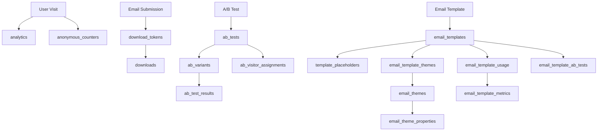

# Database Entity Relationship Diagram

## Overview
This document contains the Entity Relationship Diagram (ERD) for the Book Landing Stack database, showing all 18 tables and their relationships.

## Complete Database Schema

```mermaid
erDiagram
    %% Core Analytics & Downloads
    analytics {
        TEXT id PK
        TEXT visitor_id
        TEXT page_url
        TEXT user_agent
        TEXT ip_address
        TEXT referrer
        TEXT email
        TEXT action
        TEXT timestamp
        INTEGER scroll_depth
        INTEGER time_on_page
        TEXT created_at
    }

    downloads {
        TEXT id PK
        TEXT visitor_id
        TEXT email
        TEXT token
        TEXT ip_address
        TEXT user_agent
        TEXT created_at
    }

    download_tokens {
        TEXT id PK
        TEXT email
        TEXT token UK
        TEXT expires_at
        INTEGER used
        TEXT created_at
    }

    anonymous_counters {
        INTEGER id PK
        TEXT key UK
        INTEGER total_visits
        INTEGER total_downloads
        INTEGER total_email_submissions
        INTEGER total_goodreads_clicks
        INTEGER total_substack_clicks
        INTEGER total_publisher_clicks
        TEXT last_updated
        TEXT created_at
    }

    %% A/B Testing
    ab_tests {
        TEXT id PK
        TEXT name
        TEXT description
        TEXT type
        TEXT status
        INTEGER traffic_split
        TEXT start_date
        TEXT end_date
        TEXT target_element
        TEXT target_selector
        TEXT conversion_goal
        REAL statistical_significance
        INTEGER total_visitors
        INTEGER conversions
        REAL conversion_rate
        TEXT created_at
        TEXT updated_at
    }

    ab_variants {
        TEXT id PK
        TEXT test_id FK
        TEXT name
        TEXT description
        TEXT value
        TEXT css_class
        TEXT css_style
        INTEGER visitors
        INTEGER conversions
        REAL conversion_rate
        INTEGER is_control
        INTEGER is_winner
        REAL confidence_level
        REAL improvement
        REAL traffic_split
        TEXT created_at
        TEXT updated_at
    }

    ab_test_results {
        TEXT id PK
        TEXT test_id FK
        TEXT variant_id FK
        TEXT visitor_id
        TEXT timestamp
        INTEGER conversion
        REAL conversion_value
        TEXT created_at
    }

    ab_visitor_assignments {
        TEXT id PK
        TEXT visitor_id
        TEXT test_id FK
        TEXT variant_id FK
        TEXT assigned_at
    }

    %% Email Templates
    email_templates {
        INTEGER id PK
        TEXT name
        TEXT subject
        TEXT html_content
        TEXT text_content
        TEXT description
        INTEGER is_default
        TEXT created_at
        TEXT updated_at
    }

    template_placeholders {
        INTEGER id PK
        INTEGER template_id FK
        TEXT placeholder_key
        TEXT placeholder_name
        TEXT description
        TEXT default_value
        INTEGER is_required
        TEXT created_at
    }

    template_categories {
        INTEGER id PK
        TEXT name UK
        TEXT description
        TEXT created_at
    }

    template_categories_assignments {
        INTEGER template_id FK
        INTEGER category_id FK
    }

    %% Email Themes
    email_theme_categories {
        INTEGER id PK
        TEXT name UK
        TEXT description
        TEXT created_at
    }

    email_themes {
        INTEGER id PK
        TEXT name
        TEXT description
        INTEGER category_id FK
        INTEGER is_default
        INTEGER is_custom
        INTEGER created_by
        TEXT created_at
        TEXT updated_at
    }

    email_theme_properties {
        INTEGER id PK
        INTEGER theme_id FK
        TEXT property_key
        TEXT property_value
        TEXT property_type
        TEXT created_at
    }

    email_template_themes {
        INTEGER id PK
        INTEGER template_id FK
        INTEGER theme_id FK
        TEXT created_at
    }

    %% Email Analytics
    email_template_usage {
        INTEGER id PK
        INTEGER template_id FK
        TEXT sent_at
        TEXT recipient_email
        TEXT subject
        TEXT status
        TEXT opened_at
        TEXT clicked_at
        TEXT bounce_reason
        TEXT user_agent
        TEXT ip_address
        TEXT created_at
    }

    email_template_metrics {
        INTEGER id PK
        INTEGER template_id FK
        TEXT date
        INTEGER total_sent
        INTEGER total_delivered
        INTEGER total_opened
        INTEGER total_clicked
        INTEGER total_bounced
        INTEGER total_failed
        REAL open_rate
        REAL click_rate
        REAL bounce_rate
        TEXT created_at
        TEXT updated_at
    }

    email_template_ab_tests {
        INTEGER id PK
        TEXT test_name
        INTEGER template_a_id FK
        INTEGER template_b_id FK
        TEXT start_date
        TEXT end_date
        TEXT status
        INTEGER winner_template_id FK
        REAL confidence_level
        INTEGER total_participants
        TEXT created_at
    }

    %% Relationships
    ab_variants ||--o{ ab_tests : "belongs_to"
    ab_test_results ||--o{ ab_tests : "belongs_to"
    ab_test_results ||--o{ ab_variants : "belongs_to"
    ab_visitor_assignments ||--o{ ab_tests : "belongs_to"
    ab_visitor_assignments ||--o{ ab_variants : "assigned_to"

    template_placeholders ||--o{ email_templates : "belongs_to"
    template_categories_assignments ||--o{ email_templates : "assigned_to"
    template_categories_assignments ||--o{ template_categories : "assigned_to"

    email_themes ||--o{ email_theme_categories : "belongs_to"
    email_theme_properties ||--o{ email_themes : "belongs_to"
    email_template_themes ||--o{ email_templates : "assigned_to"
    email_template_themes ||--o{ email_themes : "assigned_to"

    email_template_usage ||--o{ email_templates : "belongs_to"
    email_template_metrics ||--o{ email_templates : "belongs_to"
    email_template_ab_tests ||--o{ email_templates : "template_a"
    email_template_ab_tests ||--o{ email_templates : "template_b"
    email_template_ab_tests ||--o{ email_templates : "winner"
```

## Table Categories

### 🔍 Core Analytics (4 tables)
- **analytics**: User interaction tracking
- **downloads**: Ebook download tracking  
- **download_tokens**: Secure download links
- **anonymous_counters**: GDPR-compliant counters

### 🧪 A/B Testing (4 tables)
- **ab_tests**: Test definitions
- **ab_variants**: Test variants
- **ab_test_results**: Test results
- **ab_visitor_assignments**: Visitor assignments

### 📧 Email Templates (4 tables)
- **email_templates**: Template definitions
- **template_placeholders**: Template placeholders
- **template_categories**: Template categories
- **template_categories_assignments**: Category assignments

### 🎨 Email Themes (4 tables)
- **email_theme_categories**: Theme categories
- **email_themes**: Theme definitions
- **email_theme_properties**: Theme properties
- **email_template_themes**: Theme assignments

### 📊 Email Analytics (3 tables)
- **email_template_usage**: Usage tracking
- **email_template_metrics**: Aggregated metrics
- **email_template_ab_tests**: Template A/B tests

## Key Relationships

### A/B Testing Flow
1. `ab_tests` → `ab_variants` (one-to-many)
2. `ab_variants` → `ab_test_results` (one-to-many)
3. `ab_tests` → `ab_visitor_assignments` (one-to-many)

### Email Template System
1. `email_templates` → `template_placeholders` (one-to-many)
2. `email_templates` ↔ `template_categories` (many-to-many via assignments)
3. `email_templates` ↔ `email_themes` (many-to-many via assignments)

### Analytics Chain
1. `email_templates` → `email_template_usage` (one-to-many)
2. `email_template_usage` → `email_template_metrics` (aggregated)
3. `email_templates` → `email_template_ab_tests` (A/B testing)

## Data Flow

## Notes

- **Primary Keys**: All tables have auto-incrementing or UUID primary keys
- **Foreign Keys**: Proper referential integrity maintained
- **Indexes**: Performance indexes on frequently queried columns
- **Triggers**: Automatic metric updates in email analytics
- **Default Data**: Pre-populated with sample data for immediate use

This schema supports a complete landing page system with analytics, A/B testing, email templates, themes, and comprehensive tracking.
